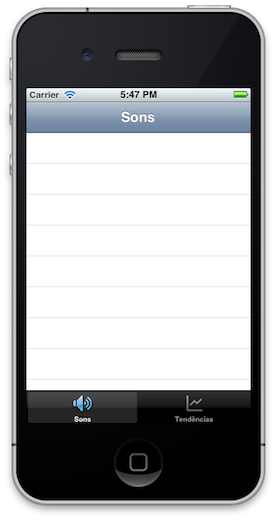

# Medo e Delírio 3GS

What if the [Medo e Delírio app](https://github.com/rafaelclaycon/MedoDelirioBrasilia) was developed in **2011** for **iOS 5**? This is a fun experimentation of developing for iOS in Snow Leopard on era-appropriate hardware.
